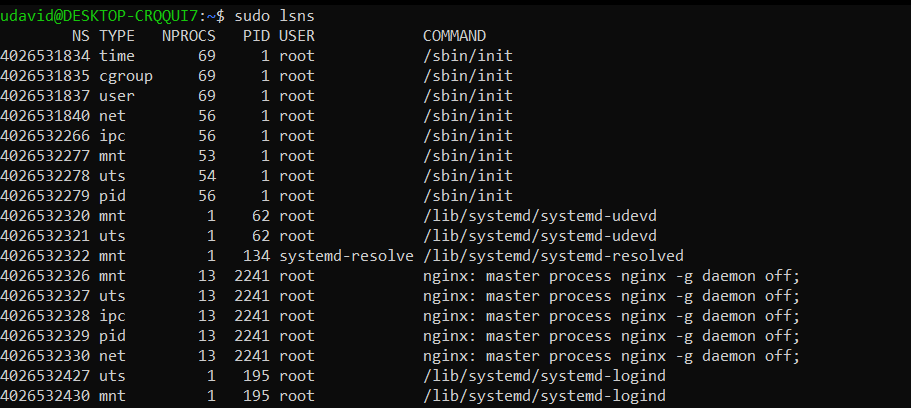
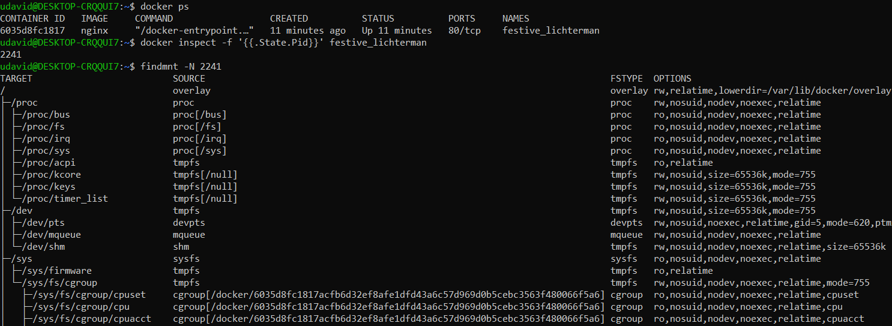
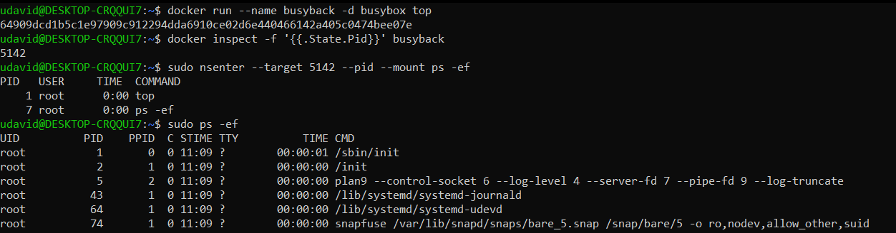
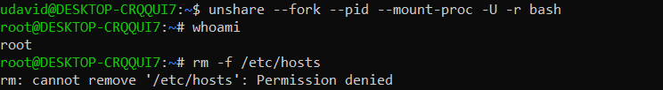
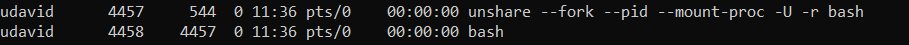

# Container Isolation Features in Linux

In this document, we will briefly showcase the features that enable the isolation of containers in Linux.

## Contents
* [Linux Namespaces](#Linux-Namespaces)
* [Capabilities](#Capabilities)
* [Control Groups (Cgroups)](#Control-Groups-(Cgroups))

## Linux Namespaces

The foundation of container isolation in Linux is built upon the concept of Linux namespaces.

#### View Namespaces on the Host
  - Use the `lsns` command to view namespaces on the host.
  - We can start a docker container with `docker run -d nginx` (a webserver with the nginx image from Docker), and then see that docker created a new set of namespaces.
    ```bash
    docker run -d nginx
    sudo lsns
     ```
  

#### Mount Namespace
  - Use `findmnt` to retrieve information about the mount namespace of a specific process, which is contained in `/proc/[PID]/mountinfo`.
  - Use `docker inspect` to find the process ID (PID) of the container. The Container name can be found using `docker ps`.
  - Use `nsenter` to execute commands inside the container's mount namespace.
    ```bash
    docker ps
    docker inspect -f '{{.State.Pid}}' [CONTAINER]
    findmnt -N [PID]
    sudo nsenter --target [PID] --mount ls /
     ```
  

#### PID Namespace
  - Start a container with the `busybox` image, and run the `top` program inside the container (so it doesn't exit).
  - Use `docker inspect` to get the PID of our container.
  - Use `nsenter` together with `ps` to examine the process list inside the container.  
    (Note: we also need to enter the `mount` namespace as `ps` needs access to the `/proc` filesystem.)
  - Execute `ps -ef` directly on the host and compare the output.  
    See if you can spot the `top` command we executed inside our container.
     ```bash
     docker run --name busyback -d busybox top
     docker inspect -f '{{.State.Pid}}' busyback
     sudo nsenter --target [PID] --pid --mount ps -ef
     ps -ef
     ```
  

#### User Namespace
  - We can use Linux's `unshare` utility to run a program in a new set of namespaces. This is esentially what Docker does, but here we do it manually.
  - Run a bash shell in a new `user` namespace with the command `unshare --fork --pid --mount-proc -U -r bash`. 
  - It appears we are the root user if we check with `whoami`. But we did not use `sudo` to run our previous command. But if we try to delete a file that only the root user would be able to access, it fails. 
  - The command fails because we only appear to be root user inside of our newly created namespace. If we start another shell on our machine and look at the process list, we can see that the bash shell started by the `unshare` command is still running as our original user, not root.
     ```bash
    unshare --fork --pid --mount-proc -U -r bash
    whoami
    rm -f /etc/hosts
    # Start a second bash shell on the machine
    sudo ps -ef
    ```
  
  

#### Other Namespaces
  - The concept of the remaining namespaces is pretty similar.
  - You can use commands like `nsenter` or `unshare` to explore them, just like we did in our previous examples.


## Capabilities

Capabilities are a great way to fine-tune security and access controls within containerized environments. With our two simple examples we try to showcase how they work.

### Code Examples:
1. **Restricting Capabilities**: 
   - Default capabilities allow changing file ownership (`chown`).
   - Dropping all capabilities then adding only `CHOWN` still allows ownership change.
   - Dropping `CHOWN` specifically results in permission denial.
   
    ```bash
    sudo docker container run --rm -it alpine chown nobody /
    sudo docker container run --rm -it --cap-drop ALL --cap-add CHOWN alpine chown nobody /
    sudo docker container run --rm -it --cap-drop CHOWN alpine chown nobody /
    # Output: chown: /: Operation not permitted
    ```

2. **Custom Capability Configuration**:
   - Granting `NET_RAW` and then dropping `NET_RAW`.
   - `NET_RAW` This capability allows processes inside the container to use raw and packet sockets, which are essential for network utilities like ping. 
   - We first run our docker without the Capability `NET_RAW` and try to ping google.com this will fail.
   - We then run our docker with the Capability `NET_RAW` and try to ping google.com this will succeed.
````bash
    docker run -d --name with_net_raw --cap-drop=NET_RAW ping_image
    docker exec -it with_net_raw ping -c 4 google.com
    # Output: OCI runtime exec failed: exec failed: unable to start container process: exec /usr/bin/ping: operation not permitted: unknown

````
````bash
    docker run -d --name with_net_raw --cap-add=NET_RAW ping_image
    docker exec -it with_net_raw ping -c 4 google.com
    # Output: PING google.com (142.251.39.46) 56(84) bytes of data.
    # 64 bytes from bud02s38-in-f14.1e100.net (142.251.39.46): icmp_seq=1 ttl=116 time=286 ms

````

## Control Groups (Cgroups)

### Identify cgroup version

Get filesystem type in a human-readable format.

```bash
stat -fc %T /sys/fs/cgroup/
```

For cgroup v2, the output is `cgroup2fs`.
For cgroup v1, the output is `cgroup`.

### Cgroup V2

### Create cgroup csan

```bash
sudo mkdir /sys/fs/cgroup/system.slice/csan
```

### Set memory limit

```bash
echo "100M" | sudo tee /sys/fs/cgroup/system.slice/csan/memory.max
```

### Add current shell process to csan cgroup

```bash
echo $$ | sudo tee /sys/fs/cgroup/system.slice/csan/cgroup.procs
```

### Remove cgroup

```bash
sudo rmdir /sys/fs/cgroup/system.slice/csan
```

### Run example

```bash
make && make run
```


## Seccomp